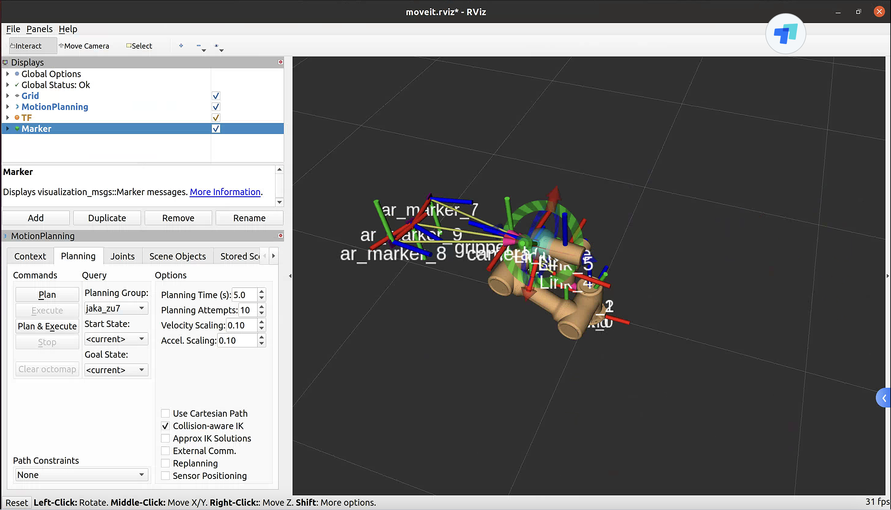

# 智慧湾JAKA机械臂代码
## 先决条件
首先打开JAKA机械臂电控柜的电源。


然后使用平板上的JAKA APP连接到机械臂电控柜。启动打开机械臂本体电源，并使能机械臂。如果机械臂上的灯光显示为绿色，说明使能成功。


在终端中运行以下命令，启动机械臂和机械臂操作的ROS程序
```bash
roslaunch zhw_jaka_ops start.launch
```

如果一切正常，上述命令会启动机械臂和机械臂操作相关的ROS程序，同时会启动rviz可视化界面，如下图所示。在rviz可视化界面中，应该可以看到机械臂的姿态和物理世界中机械臂的姿态一致，并且能在rivz看到机械爪上安装的相机视角内的二维码。二维码的frame以ar_frame开头。




## 封装的机械臂能力

### 控制夹爪松紧

zhw_jaka_msgs/srv/JakaSetGripperTightness.srv
```
float64 tightness
---
bool success
string message
```
`tightness`表示机械爪的松紧度。0.0为最松，1.0为最紧。

`success`表示是否成功执行。

`message`表示执行结果的信息。

```bash
fdse-arm@fdsearm:~/ros_code$ rosservice call /zhw_jaka_wrapper/set_gripper_tightness "tightness: 1.0" 

success: True
message: "gripper tightness set to 1.0"
```
### 移动夹爪到空间中指定位姿（相对于机械臂底盘坐标系）
zhw_jaka_msgs/srv/JakaMoveGripperToPose.srv

```
float32[] pose
---
bool success
string message
```

`pose`应为一个长度为6的数组，类似于`[x, y, z, rx, ry, rz]`。前三个元素代表坐标，后三个元素是欧拉角。

`success`表示是否成功执行。

`message`表示执行结果的信息。

```bash
rosservice call /zhw_jaka_wrapper/move_gripper_to_pose "pose: [0, 0, 0, 0, 0, 0]" 

success: False
message: "Failed"
```

### 移动机机械臂六个关节到指定角度

zhw_jaka_msgs/srv/JakaMoveJoints.srv

```
float32[] joint_values
---
bool success
string message
```

`joint_value[0]`~`joint_value[5]`分别代表机械臂关节1～关节6的角度。

`success`表示是否成功执行。

`message`表示执行结果的信息。

```bash
rosservice call /zhw_jaka_wrapper/move_joints "joint_values: [-3.
2287884849090203, 0.3889835751924734, 2.329802144868561, 0.443159886524249, -4.669364354537797
, 2.3346812392809193]" 

success: True
message: "Success"
```

### 根据物体上的二维码抓取物体，并将物体放置在小车上

首先，需要保证待抓取的物体的二维码在相机的视角内，且在rviz中可以看到二维码及其frame。

zhw_jaka_msgs/srv/JakaPickByMarkerId.srv

```
int64 markerId
---
bool success
string message
```

`markerId`表示二维码的id。

`success`表示是否成功执行。

`message`表示执行结果的信息。

```bash
rosservice call /zhw_jaka_ops/shelf2cart_byMarkerId "markerId: 9"

success: True
message: "Successfully pick object with markerId = 9 onto cart"
```

#### 二维码生成方法
使用以下方法生成大小为4cm*4cm，id为1的二维码。

注意二维码的大小必须是4cm，且应该等宽打印。
```bash
rosrun ar_track_alvar createMarker -s 4.0 1

ADDING MARKER 1
Saving: MarkerData_1.png
```
